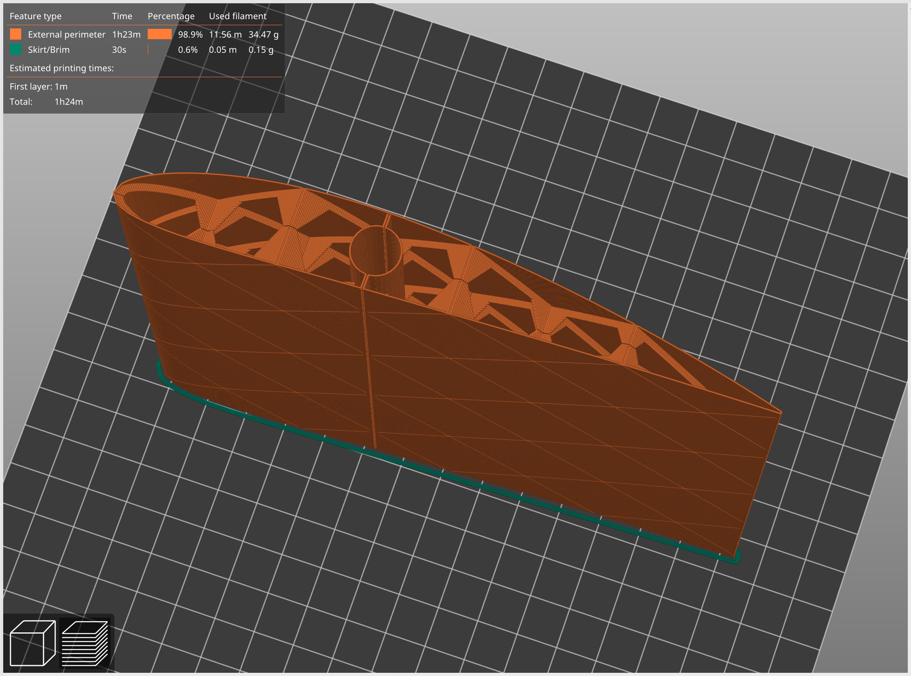

# Parametric vase-mode 3D-printable structurally reinforced NACA wing

Parametric OpenSCAD project which generates a wing based on a NACA airfoil. The generated 3D-model can be printed without retractions in (spiral) vase mode.

Example of the default config: a 150mm long, NACA 4412 wing with a chord length of 150mm:
